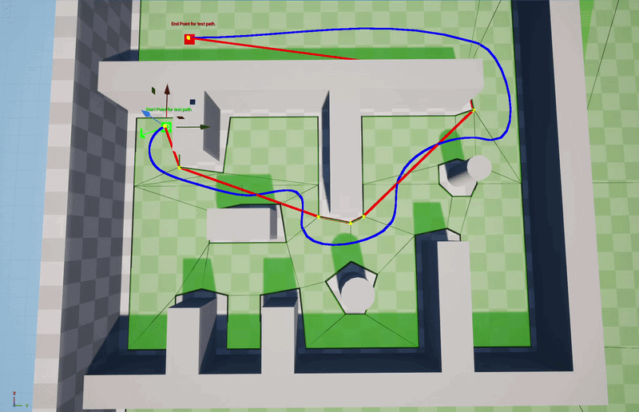
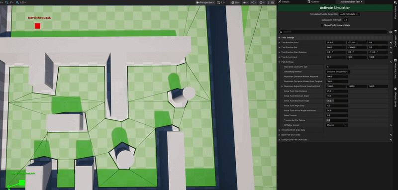

# :cyclone: Nav Smoother :cyclone:

A custom path smoothing solution built on top of Unreal Engine's navmesh system. 
The aim is to create natural-looking paths for the nav agents.

## :camera_flash: How it looks :camera_flash:

<table>
<tr>
<td width="50%" align="center">

</td>

<td width="50%" valign="center">

* <b>Red line:</b> String-pulled path. (Generated by Unreal.)
* <b>Blue line:</b> Smoothed path.

</td>
</tr>
</table>

## :sparkles: Features overview :sparkles:

* Takes Unreal's string-pulled path, adjusts the path points, then applies Catmull-Rom spline interpolation.
* Supports starting direction, with settings for turn-angle limits.
* Design-time testing with a custom dockable Slate tool.
  * Adjustable start and end points without the need for actors to be placed.
  * Periodic live updates, with the option to switch to manual updates.
  * Separately visualising each adjustment pass, from the string-pulled path to the final smoothed path.
* On-screen performance metrics for the smoothing process can be turned on directly in the tool.

## :gear: Settings and testing tools :gear:

<table>
<tr>
<td width="50%" align="center">

</td>

<td width="50%" valign="center">

* The testing window can be found in the Tools menu, under `Nav Smoother Testing`.
* All relevant settings are exposed to customise the path smoothing process.
* Any changes the tool makes to the level are transient and won't get saved.

</td>
</tr>
</table>

## :clipboard: Requirements :clipboard:

This project relies on Unreal Engine's `UNavigationSystemV1` and is compatible with UE 4.x.x-5.x.x versions.

